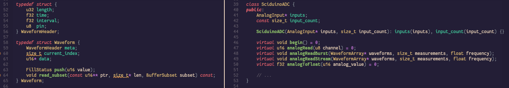
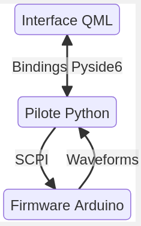
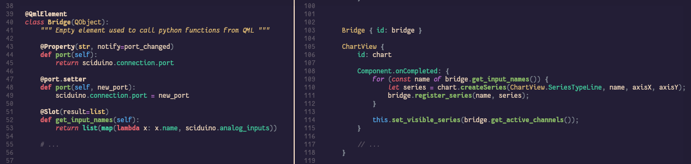
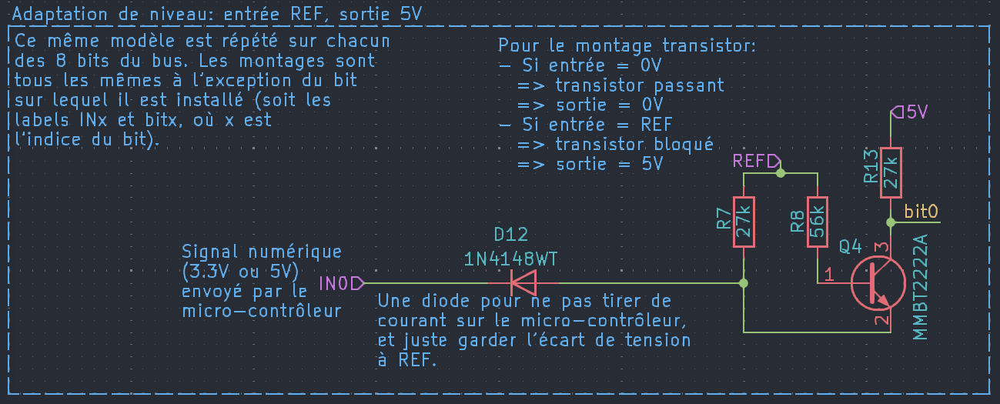
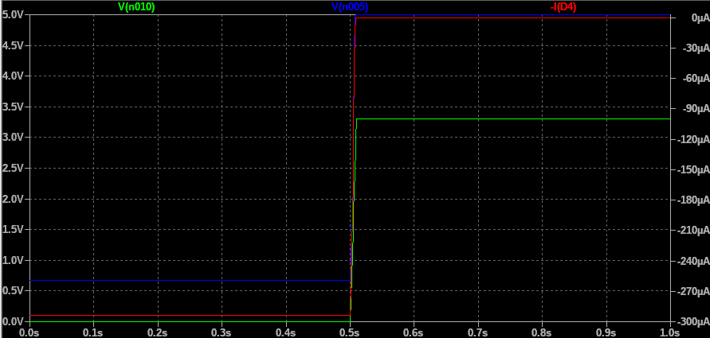
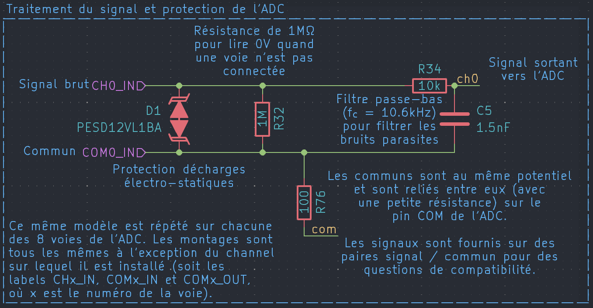

# Rapport de stage

## Contexte

### RBI Instrumentation

[RBI instrumentation](https://rbi-instrumentation.com) est une TPE meylanaise spécialisée dans l’instrumentation. Elle ne compte aujourd’hui que 4 salariés :

- Aurélien Rosset, électronicien, directeur
- Jean Arnault, ingénieur mécanique et spécialiste en mécanique des fluides
- Hugo Vernier-Lambert, ingénieur mécatronique (mon maitre de stage)
- Julien Lorent, câbleur.

L’équipe est épaulée par 4 prestataires réguliers pour la gestion, la conception électronique, le câblage électronique et le développement logiciel.

RBI est en activité depuis plus de 30 ans, sur trois principaux domaines.

1. **Les sondes optiques** pour l’étude d’[écoulements diphasiques](https://fr.wikipedia.org/wiki/%C3%89coulement_diphasique). C’est l’activité historique sur laquelle RBI a démarré.

2. **Les bancs de test**, notamment pour qualifier les équipements aéronautiques produisant l’[oxygène de bord](https://fr.wikipedia.org/wiki/Concentrateur_d%27oxyg%C3%A8ne). Cette activité a démarré il y a une dizaine d’années avec l’arrivée de deux personnes issues d’une société spécialisée dans le domaine, et c’est la principale source de revenus de RBI aujourd’hui.

3. **Le câblage industriel**. C’est l’activité la plus récente.

RBI a été rachetée en 2023 par [BIGATA](https://www.bigata.net), une société bordelaise spécialisée en équipements aéronautiques. Elle porte aujourd’hui officiellement le nom de SN·RBI pour « Société Nouvelle RBI ».

RBI réalise un chiffre d’affaire annuel d’environ 900 k€/an (chiffre 2017).

### Technologies

Pour ses développements, RBI se repose beaucoup sur les produits [National Instruments](https://ni.com) (NI) :

- pour les cartes mutifonctions (MIO) et d’acquisition de données (DAQ) ;
- pour l’environnement de développement logiciel (LabVIEW).

Ce choix a fonctionné longtemps, mais est remis en cause par des choix récents de NI en matière de gestion d’obsolescence : leur durée de support n’est pas très longue (4 ans pour chaque version de LabVIEW, une dizaine d’années pour les cartes DAQ), et ils n’ont pas toujours de remplacement viable quand ils arrivent en fin de vie. Cela s’est produit pour une carte DAQ cruciale pour un banc de test RBI ; et l’avenir de LabVIEW reste incertain, NI en ayant annoncé la [fin de vie au profit de NXG](https://labviewwiki.org/wiki/LabVIEW_NXG) en 2017, avant de décider l’inverse en 2020.

Par ailleurs, ces produits sont chers (le prix des licences LabVIEW a récemment explosé) et de moins en moins adaptés aux applications industrielles. Ces produits étant fermés, il est difficile de les remplacer par une alternative tierce sans remettre en cause tout le développement.

RBI souhaite donc envisager d’autres technologies pour ses développements à venir.

### Objectifs du stage

= proposer une stack techno alternative et pérenne, pour compléter ou remplacer la stack NI.

On souhaite particulièrement explorer :

- les possibilités des micro-contrôleurs (MCU) pour remplacer les cartes NI ;
- les solutions logicielles liées à Python, très utilisé par les clients de RBI, pour remplacer LabVIEW.

Deux développements doivent permettre de valider la stack techno :

- une carte DAQ 16 bits / 1 kHz
- une carte DAQ 8 bits / 1 MHz

### Gestion de projet

On travaille en mode Agile avec des objectifs incrémentaux et des cycles courts de développement. Le suivi est fait via Kanban dans l’espace CryptPad de l’équipe.

Le projet nécessite trois types de compétences :

1. **Le développement informatique** (MCU et PC). C’est le domaine sur lequel j’ai suffisamment d’expérience pour être totalement autonome.

2. **La connaissance de l’écosystème embarqué.** L’équipe a une petite culture Arduino, j’ai utilisé des STM32 à l’école, mais personne n’a d’expertise sur le sujet : les options proposées à RBI viennent de mes recherches sur Internet et de ma veille technologique, et sont à valider par l’équipe et leur prestataire informatique.

3. **La conception électronique.** Je n’ai qu’une formation théorique et aucune expérience en conception, mais c’est le domaine où RBI excelle : je peux compter sur l’équipe et le prestataire électronique pour m’aider à monter en compétence. C’est le sujet sur lequel j’ai le moins d’autonomie.

L’avancement du projet est jalonné par les démonstrations techniques et les revues de design des électroniciens. Chacune de ces étapes de validation est l’occasion d’ajuster les objectifs du projet.

### Livrables attendus

- code source commenté côté MCU et PC
- documents de conception électronique : schémas, routages
- fiches de synthèse justifiant les solutions envisagées

Le code et les documents relatifs à [Sciduino][2] sont décrits en anglais, et disponibles sous licence libre (GPLv3) sur [le dépôt GitHub](https://github.com/Nuclear-Squid/Sciduino).

Le code et les documents de conception spécifiques aux projets [BTO][3] et [Dionysos][4] sont la propriété de RBI, et ne sont pas inclus dans ce rapport. RBI m’autorise à en publier des extraits pertinents pour la rédaction.

[2]: #stack-technique-proposée-sciduino
[3]: #carte-bto-16bits-1khz
[4]: #carte-dionysos-8bits-1mhz

## Stack technique proposée : Sciduino
Sciduino = [SciPy] + [PySide] + [Arduino]

[SciPy]: https://scipy.org/
[PySide]: https://doc.qt.io/qtforpython-6/
[Arduino]: https://docs.arduino.cc/software/

### Stack matérielle

Plus que de simples MCU, on cherche un écosystème de cartes de développement avec un bon rapport facilité/pérennité. On a exploré les solutions disponibles pour avoir une vue d’ensemble des puces (fiche [MCU Chips]), des cartes de développement ([MCU Boards]) et de leurs empreintes/pinouts ([MCU Interfaces]).

[MCU Chips]:      https://github.com/Nuclear-Squid/Sciduino/blob/report/doc/mcu_chips.md
[MCU Boards]:     https://github.com/Nuclear-Squid/Sciduino/blob/report/doc/mcu_boards.md
[MCU Interfaces]: https://github.com/Nuclear-Squid/Sciduino/blob/report/doc/mcu_interfaces.md

Le choix s’est vite restreint à trois options : Arduino, STM32, Raspberry Pi.

**Arduino : l’Espéranto de l’embarqué**

- avantages :
  - [environnement logiciel][Arduino] simple, libre et complet : [Arduino-IDE], [Arduino-CLI]…
  - agnostique : AVR, ARM Cortex‑M, ESP32, RISC-V…
  - gestion saine de l’obsolescence (maintien de puces 8-bits, [remplacement de ARM Mbed par Zephyr](https://blog.arduino.cc/2024/07/24/the-end-of-mbed-marks-a-new-beginning-for-arduino/)…)
  - les empreintes Uno et Nano sont là pour durer
  - large choix de périphériques disponibles, souvent en open-hardware
  - compétences faciles à trouver (hobbyistes notamment)
  - très simple à prendre en main (IDE, HAL…)

- inconvénients :
  - l’IDE privilégie la portabilité et la facilité aux performances
  - image très « amateur »

[Arduino-IDE]: https://docs.arduino.cc/software/ide/
[Arduino-CLI]: https://docs.arduino.cc/arduino-cli/

**STM32 : la référence industrielle**

- avantages :
  - c’est la solution la plus utilisée actuellement en industrie
  - large choix de puces et de cartes de développement
  - l’IDE permet de viser de très bonnes performances
  - compatibilité *correcte* avec Arduino ([stm32duino] + empreintes Uno/Nano)

- inconvénients :
  - environnement logiciel lourd (fork d’Eclipse) et [non-libre](https://www.st.com/resource/en/license/SLA0048_STM32CubeIDE.pdf) (mais des alternatives GCC sont possibles)
  - impose une architecture matérielle (ARM Cortex‑M)
  - gestion moins claire de l’obsolescence (les documents STM32 se réfèrent toujours à ARM Mbed, dont la fin de vie est programmée pour juin 2026)
  - puces maintenues 10 ans, donc pas mieux que NI

**Raspberry Pi Pico : l’alternative hi-speed/low-cost**

- avantages :
  - environnement logiciel libre : [MicroPython](
https://datasheets.raspberrypi.com/pico/raspberry-pi-pico-python-sdk.pdf) ou [SDK C/C++](https://datasheets.raspberrypi.com/pico/raspberry-pi-pico-c-sdk.pdf)
  - excellents micro-contrôleurs ([rp2040], [rp2350]) et cartes de développement ([Pico], [Pico2])
  - les [PIO] ouvrent [des possibilités uniques](https://blog.ploopy.co/rp2040-the-little-engine-that-could-96)
  - pas limité à ARM Cortex‑M (le rp2350 propose du RISC–V)
  - puces maintenues 20 ans
  - prix

- inconvénients :
  - l’empreinte Pico est peu utilisée hors Raspberry
  - choix limité de MCU

Arduino semble avoir le meilleur compromis facilité/pérennité, malgré son image hobbyiste. Il y a déjà eu des projets Arduino chez RBI et le passage à STM32 n’apporterait aucun avantage suffisamment net ; si on devait changer, ça serait plutôt pour Raspberry.

[rp2040]: https://datasheets.raspberrypi.com/rp2040/rp2040-datasheet.pdf
[rp2350]: https://datasheets.raspberrypi.com/rp2350/rp2350-datasheet.pdf
[pico]:   https://datasheets.raspberrypi.com/pico/pico-product-brief.pdf
[pico2]:  https://datasheets.raspberrypi.com/pico/pico-2-product-brief.pdf
[PIO]:    https://magazine.raspberrypi.com/articles/what-is-programmable-i-o-on-raspberry-pi-pico

### Développement sur *breadboard*

Les cartes NI sont faciles à connecter à des signaux extérieurs, via des borniers à vis le plus souvent.

Pour retrouver cette facilité on utilise des cartes des développement au format DIP et des *breadboards*. L’idée est de :

1. valider un schéma sur la *breadboard* ;
2. commencer le développement logiciel sans attendre que le PCB soit finalisé ;
3. transférer la carte contrôleur de la breadboard au PCB quand il est prêt.

RBI ne faisant pas de production en série, intégrer le MCU directement sur le PCB n’a pas d’intérêt. On préfère donc choisir une empreinte et un pinout aussi stable que possible — v. fiche [MCU Interfaces].

**L’empreinte Nano est une bonne passerelle :**

- large choix de MCU, incluant le Raspberry Pi [RP2040] qui bénéficie du support officiel Arduino ;
- bonne compatibilité avec STM32, grâce à [stm32duino] (maintenu par la communauté) et au format [Nucleo32] (même empreinte/pinout mais attention, le connecteur USB est placé à l’opposé de la position Arduino) ;
- très répandue, on peut donc espérer une bonne longévité de ce format.

[stm32duino]: https://www.stm32duino.com/
[Nucleo32]:   https://www.st.com/resource/en/data_brief/nucleo-f031k6.pdf

| Référence     | Contrôleur  | Architecture  | Horloge | E/S   |
|:--------------|-------------|---------------|--------:|------:|
| [Nano]        | ATmega 328  | AVR           |  16 MHz |   5 V |
| [Nano Every]  | ATmega 4809 | AVR           |  20 MHz |   5 V |
| [Nano 33 BLE] | nRF52840    | Cortex‑M4     |  64 MHz | 3.3 V |
| [Nano Matter] | MGM240S     | Cortex‑M33    |  78 MHz | 3.3 V |
| [Nano RP2040] | RP2040      | 2× Cortex‑M0+ | 125 MHz | 3.3 V |
| [Nano ESP32]  | ESP32-S3    | 2× Xtensa LX7 | 240 MHz | 3.3 V |

[Nano]:        https://store.arduino.cc/collections/nano-family/products/arduino-nano
[Nano Every]:  https://store.arduino.cc/products/nano-every-with-headers
[Nano 33 BLE]: https://store.arduino.cc/products/nano-33-ble-rev2-with-headers
[Nano Matter]: https://store.arduino.cc/collections/boards-modules/products/nano-matter-with-headers
[Nano RP2040]: https://store.arduino.cc/collections/nano-family/products/arduino-nano-rp2040-connect-with-headers
[Nano ESP32]:  https://store.arduino.cc/collections/boards-modules/products/nano-esp32-with-headers

**I²C pour l’extensibilité :**

- standard ancien et solide, très largement diffusé ;
- connectable en daisy-chain, un même contrôleur I²C peut piloter plusieurs équipements ;
- beaucoup de cartelettes sont disponibles avec des connecteurs [Qwiic], [Stemma], [Stemma QT] qui sont compatibles (électriquement) entre eux — à privilégier à [Grove] (propriétaire) et [Gravity] (compatible mécaniquement mais pas électriquement, attention !).

[Grove]:     https://wiki.seeedstudio.com/Grove_System/
[Stemma]:    https://learn.adafruit.com/introducing-adafruit-stemma-qt/what-is-stemma
[Stemma QT]: https://learn.adafruit.com/introducing-adafruit-stemma-qt/what-is-stemma-qt
[Qwiic]:     https://www.sparkfun.com/qwiic
[Gravity]:   https://www.dfrobot.com/gravity

À l’usage, on a trouvé que les périphériques I²C étaient plus pratiques que les *shields* Arduino, y compris pour le prototypage : pas de conflits d’usage de broche, pas de contraintes de forme.

**SPI pour les fonctions critiques en performance :** c’est notamment le choix qu’on a retenu pour les ADC mis en œuvre. C’est un standard très simple sur le principe mais assez laxe, donc moins simple à utiliser que I²C.

### Stack logicielle

Le projet Sciduino cherche à créer une « boîte à outils » simple, basée sur du logiciel libre et pérenne, pour réduire voire supprimer la dépendence à National Instruments. Comme avec LabVIEW et les cartes NI-DAQ, l’objectif est de pouvoir facilement afficher à l’écran un signal mesuré d’un capteur avec le traitement nécessaire. Sciduino est basé une stack logicielle séparée en trois étages disctincts :

1. le code Arduino qui pilote le micro contrôleur et effectue les mesures ;
2. un module Python pour s’interfacer avec le micro-contrôleur ;
3. une interface graphique en QML qui affiche les informations reçues.

L’objectif de cette stack logicielle est de limiter le couplage entre les différentes fonctions nécessaires (acquisition, pilotage, affichage), mais aussi de se limiter à des outils simples et libres.

**Firmware Arduino**

Le firmware tournant sur le micro-contrôleur est écrit en Arduino afin de pouvoir rapidement prototyper du code qui fasse abstraction du matériel sur lequel il va tourner. Différntes alternatives ont été envisagées, notamment [MicroPython], très pratique mais dont le support matériel et plus limité, et [PlatformIO], plus complet mais dont la gestion d’obsolescence n’a pas convaincu (notamment parce qu’il reste [limité aux versions obsolètes de Zephyr](https://github.com/zephyrproject-rtos/zephyr/pull/53303), le RTOS de référence).

Aujourd’hui, le code micro-contrôleur s’articule autour de :

- une API faisant abstraction de différents ADC communément utilisés par l’équipe, facile à étendre ;
- une structure de données pour représenter les entrées analogiques et sorties numériques utilisées ;
- une structure `Waveform` qui stocke une portion de signal.

La carte peut effectuer une mesure « one-shot », mesurer une fenêtre temporelle (*burst*) ou mesurer en continu (*streaming*) sur toutes les voies activées, et stocker les mesures dans différentes waveforms avant de les envoyer à l’ordinateur.

Afin d’échanger des instructions et informations entre la carte et l’ordinateur, on utilise le protocole [SCPI]. Cela permet d’écrire des instructions à la main pour débugger depuis une console série, mais aussi ne pas dépendre d’un pilote spécifique dans l’application desktop. Cependant, la carte permet aussi de renvoyer les mesures et informations en binaire pour de meilleures performances.

[SCPI]: https://fr.wikipedia.org/wiki/Standard_Commands_for_Programmable_Instruments

**Pilote Python**

Un module Python est développé en parallèle pour s’interfacer avec le micro-contrôleur. Il exporte un objet `Sciduino` qui récupère la configuration des entrées / sorties de la carte et contient des méthodes pour envoyer des instructions à la carte puis parser les réponses en des types natif à Python ou dans des tableaux Numpy (comme le contenu des `Waveform` envoyé par la carte).

Ce module est écrit en Python car c’est un langage simple, interprété, cross-plateform et qui possède un écosystème très complet, notamment pour les applications scientifiques. Les piètres performances de Python ne sont pas un problème : toutes les parties critiques en performances sont exécutées soit sur le micro-contrôleur, soit par des bibliothèques optimisées pour le calcul (NumPy, SciPy, Pandas…), soit par un framework d’interface graphique C++.

**Interface graphique QML**

Pour l’interface graphique on utilise QML, un langage de description basé sur Qt (backend) et JS (frontend). Il combine :

- un langage de description plutôt simple, et éditable graphiquement ;
- une grande librairie standard de composants simples à utiliser ou étendre ;
- des graphiques optimisés par OpenGL ;
- des bindings vers C++ (via le framework Qt) ou Python (via la bibiothèque PySide6).

En plus du code QML nécessaire pour créer l’interface graphique, un second module Python définit les bindings nécessaire pour transmettre les commandes de l’interface au pilote de la carte, puis mettre en forme les réponses avant de les afficher dans l’interface.

<!-- TODO: Rajouter un screenshot de l’appli -->

<!-- TODO: fusionner ici le document « stack logicielle » -->
<!---->
<!-- - desktop : Python + QML -->
<!--   - Python = simplicité -->
<!--   - Qt/QML = le standard de fait pour les apps industrielles -->
<!--   - compétences faciles à trouver -->
<!---->
<!-- - analyse : SciPy <3 -->
<!--   - what else ? -->
<!--   - cf. alternative C++ -->
<!--   - prototypage et rapports d’analyse avec Jupyter Notebook -->
<!---->
<!-- - IDE micro-contrôleur -->
<!--   - [Arduino-IDE] ? simple, efficace, possiblement limité en perfs -->
<!--   - [PlatformIO] ? intéressant mais [limité à une version obsolète de Zephyr](https://github.com/zephyrproject-rtos/zephyr/pull/53303) -->
<!--   - [MicroPython] ? intéressant mais limité aux MCU très véloces, et moins de support matériel pour les périphériques -->
<!---->
<!-- - SCPI -->
<!--   - un standard laxe de communication entre instruments, basé sur du texte -->
<!--   - débug facile avec un simple moniteur série -->
<!--   - permet de livrer des apps PC sans pilote logiciel -->

[PlatformIO]:  https://platformio.org/
[MicroPython]: https://micropython.org/

### Mise en œuvre

Grâce à Sciduino, un Arduino peut rapidement devenir un périphérique DAQ : les abstractions sur les ADCs permettent d’utiliser l’ADC interne de l’Arduino pour rapidement prototyper une application, puis passer à un ADC externe plus précis sans changement majeur dans le code.

La communication avec le PC se fait via une liaison série : les cartes AVR exposent un port COM virtuel, les cartes ARM possèdent une API nommée `SerialUSB` qui permet d’échanger directement via le bus USB, ce qui augemente drastiquement le débit de transfert.

L’approche SCPI illustre bien la différence de démarche avec les produits NI : au lieu d’acquérir directement les données brutes via le PC, c’est le MCU qui est en charge de l’essentiel de l’acquisition *et du traitement*. Les données remontées au PC sont donc minimes, et le développement desktop se concentre sur la présentation des données.

Pour présenter les informations dans l’interface graphique QML, nous avons créé des bindings entre l’interface et le driver Python. Bien que l’environnement Qt soit originellement codé en C++, la librairie `PySide6` nous permet de lancer une application QML et développer des éléments graphique custom en Python. Un patern récurrent est de définir un élément `Bridge`, chargé de faire l’interface entre l’interface graphique et le backend Python / C++ de l’application.

La classe `Bridge` est automatiquement exportée en tant qu’objet QML grâce au décorateur `QmlElement`, et défini des proriété et méthodes via les décorateurs `property` et `slot` respectivement. Une fois mis en place, l’élément `Bridge` peut être intégré au code d’interface, et ses propriété / méthodes peuvent être utilisés comme n’importe quel autre élément QML.

Grâce à Python, l’application desktop est développée, mise au point et débuguée sur un PC, mais peut ensuite être exécutée paur un SBC type Raspberry Pi — contrairement à LabVIEW — sans nécessiter de recompilation.

**Retour d’expérience** après quelques semaines d’utilisation :

- LabVIEW est l’option la plus rapide pour prototyper ;
- Python/QML reste simple, et permet de livrer des apps mieux finies :
  - versionnement SVN ou Git possible (pas de `diff` avec LabVIEW)
  - qualité logicielle (lint, typage…) : `ruff`, `uv`, `mypy`
  - GUI bien séparée du reste du code
  - installeur de taille raisonnable (PyInstaller)
  - le client final peut modifier l’app sans dépendances logicielles
- l’approche SCPI facilite la portabilité du code LabVIEW ou Python, sans nécessiter de pilote spécifique.

### Cadence d’échantillonnage

Pour un fonctionnement en mode *streamnig* (acquisition de données en direct sur le PC, en utilisant le MCU comme une carte NI), les premiers tests ont mis en évidence une limitation inattendue de la cadence d’échantillonnage : c’est souvent l’USB et non l’ADC qui bride les performances.

- La plupart des cartes MUC ont un contrôleur USB 1.1, limité au débit `full-speed` soit 12 Mbds théoriques — et au mieux 1 MB/s en pratique (Arduino Nano 2040), parfois sulement 600 kB/s.

- Certaines cartes comme l’Arduino Due ont un contrôleur USB 2.0 mais attention, toutes ne permettent pas le débit `hi-speed` de 480 Mbds ; et même quand c’est le cas, ça reste un débit théorique (*[signaling rate]*) : le débit réel de transfert de données est très inférieur, de l’ordre de 30 MB/s pour une clé USB, et quasiment 10 fois moins pour le seul contrôleur `hi-speed` qu’on ait pu tester (Arduino Due). 

- D’autres cartes comme l’Arduino Giga, avec sa puce STM32H747, ont à la fois un contrôleur `full-speed` et un contrôleur `hi-speed`… mais c’est le premier qui est utilisé pour communiquer avec le PC, semble-t-il. Avec un débit nettement inférieur à celui du RP2040.

[signaling rate]: https://en.wikipedia.org/wiki/USB_communications#Signaling_(USB_PHY)

> *[TODO: partie `pyserial` à revoir]*

> Côté Python, les vitesses de transmission USB ont été évaluées en envoyant le texte dans le moniteur série d’arduino-cli. On évalue maintenant les perfs de différentes libs USB.
>
> * **pyserial**: On constate un très gros écart de performance (100 kHz max) si on lit trop de données d’un coup avec pyserial (avec un `readline` trop long, par exemple). Allouer à l’avance un `bytearray` suffisemment long et écrire dedans ce qu’on reçoit par des plus petits paquets élimine les réallocs et rend cet overhead négligeable.
>
> * **pyusb**: Beaucoup trop compliqué à mettre en place. Pyserial est probablement suffisamment rapide pour la plupart des applications.

Arduino propose systématiquement 8 entrées analogiques sur ses contrôleurs, avec une cadence d’ADC typiquement entre 4 et 10 µs (100 à 250 kHz). Pour envoyer un *stream* continu de 8 voies (800 kS/s à 2 000 kS/s), il faudrait un débit USB de 1.6 à 4 MB/s — et aucune carte Arduino ne semble permettre de transférer un tel flux de données.

|                   | Due               | Nano 2040         | Giga R1 Wifi
|:------------------|------------------:|------------------:|---------------:
| MCU               | Atmel SAM3X3E     | RP2040            | STM32H747XIH6
| architecture      | Cortex-M3         | 2× Cortex-M0+     | Cortex‑M7 + M4
| horloge           | 84 MHz            | 125 MHz           | 480 MHz 240 MHz
| mémoire flash     | 512 kB            | 16 MB             | 2 MB
| mémoire SRAM      | 96 kB             | 264 kB            | 1024 kB
| débit USB réel    | 2.8 MB/s          | 1.0 MB/s          | 0.67 MB/s
| cadence USB max. (8 voies) | ~170 kHz |  ~60 kHz          |  ~40 kHz
| cadence ADC       |          ~230 kHz | ~250 kHz          | ~110 kHz

STM32 propose des cartes Nucleo dédiées à l’acquisition rapide de données. Mais là encore, leur contrôleur USB `full-speet` les limite à 1 MB/s. On ne peut donc streamer qu’une seule voie à sa cadence d’échantillonnage maximale.

| Carte           | Référence | MCU             | ADC                         
|:--------------- |:---------:| ----------------|-------- 
| [Nucleo-F303K8] | [MB1180]  | [STM32F303K8T6] | 2 × 0.20μs (~400 kHz)
| [Nucleo-G431KB] | [MB1430]  | [STM32G431KBT6] | 2 x 0.25µs (~500 kHz)
| [Nucleo-L412KB] | [MB1180]  | [STM32L412KBU3] | 2 × 0.20μs (~400 kHz)

[MB1180]: https://www.st.com/resource/en/user_manual/dm00231744.pdf
[MB1455]: https://www.st.com/resource/en/user_manual/dm00622380.pdf
[MB1430]: https://www.st.com/resource/en/user_manual/dm00493601.pdf

[Nucleo-F031K6]: https://www.st.com/en/product/nucleo-f031k6
[Nucleo-F042K6]: https://www.st.com/en/product/nucleo-f042k6
[Nucleo-F303K8]: https://www.st.com/en/product/nucleo-f303k8
[Nucleo-G031K8]: https://www.st.com/en/product/nucleo-g031k8
[Nucleo-G431KB]: https://www.st.com/en/product/nucleo-g431kb
[Nucleo-L011K4]: https://www.st.com/en/product/nucleo-l011k4
[Nucleo-L031K6]: https://www.st.com/en/product/nucleo-l031k6
[Nucleo-L412KB]: https://www.st.com/en/product/nucleo-l412kb
[Nucleo-L432KC]: https://www.st.com/en/product/nucleo-l432kc

[STM32F031K6T6]: https://www.st.com/en/microcontrollers-microprocessors/stm32f031k6.html
[STM32F042K6T6]: https://www.st.com/en/microcontrollers-microprocessors/stm32f042k6.html
[STM32F303K8T6]: https://www.st.com/en/microcontrollers-microprocessors/stm32f303k8.html
[STM32G031K8T6]: https://www.st.com/en/microcontrollers-microprocessors/stm32g031k8.html
[STM32G431KBT6]: https://www.st.com/en/microcontrollers-microprocessors/stm32g431kb.html
[STM32L011K4T6]: https://www.st.com/en/microcontrollers-microprocessors/stm32l011k4.html
[STM32L031K6T6]: https://www.st.com/en/microcontrollers-microprocessors/stm32l031k6.html
[STM32L412KBU3]: https://www.st.com/en/microcontrollers-microprocessors/stm32l412kb.html
[STM32L432KCU3]: https://www.st.com/en/microcontrollers-microprocessors/stm32l432kc.html

**Jusqu’où un MUC peut-il remplacer une carte NI-DAQ ?**

L’intérêt d’une carte MUC consiste à faire l’acquisition *et le traitement* des données *avant* d’en envoyer le résultat au PC. On peut quand même streamer des données en continu :

- pour les bancs de test pneumatiques de RBI, où on se contente de 1 kHz ;
- pour les applications audio, où l’USB `full-speed` permet de passer 8 voies 16 bits à 48 kHz ;
- mais pas pour les applications nécessitant un échantillonnage plus rapide.

Pour l’acquisition haute fréquence, les [PicoScope] et leur port USB3 sont de bonnes alternatives : beaucoup plus rapides que les cartes NI du moment, avec un bon SDK et des pilotes pour Windows, macOS, Linux. Il y a aussi le projet *open-hardware* [ThunderScope], qui pousse les performances encore plus loin, en utilisant directement la RAM et le GPU du PC.

**Utiliser un protocole réseau plutôt qu’USB ?**

Une alternative serait d’utiliser un micro-contrôleur avec un port Ethernet 100 Mbds. STM32 en propose au format Nucleo144 (simili Uno) avec les [h7s3l8] et [n657x0-q]. Il y a aussi le [RP2040-ETH] de Waveshare. On pourrait aussi, tout simplement, utiliser la connectivité WiFi du Giga R1, du Nano RP2040, ou d’un autre MUC orienté IoT. Mais cela sort du cadre fixé pour ce projet.

Quitte à utiliser un protocole réseau, un SBC comme le [RPi Zero 2 W] serait plus approprié :

- bien meilleures performances (quad-core 64 bits 1 GHz, 512 MB de RAM)
- un vrai PC, avec serveur HTTP, port HDMI, stockage persistant (MicroSD)
- le GPIO Raspberry, pour les périphériques HAT
- low-cost (environ 15 €)

[h7s3l8]:     https://www.st.com/en/evaluation-tools/nucleo-h7s3l8.html
[n657x0-q]:   https://www.st.com/en/evaluation-tools/nucleo-n657x0-q.html
[RP2040-ETH]: https://www.waveshare.com/wiki/RP2040-ETH

[PicoScope]:    https://www.picotech.com/products/oscilloscope
[ThunderScope]: https://github.com/EEVengers/ThunderScope
[RPi Zero 2 W]: https://www.raspberrypi.com/products/raspberry-pi-zero-2-w/

### Perspectives

Avec Sciduino, un Arduino peut être utilisé en lieu et place d’une carte NI-DAQ dans tous les cas d’usage de RBI. Le principal avantage est qu’un banc de test conçu autour d’un MCU peut fonctionner de façon autonome : la connexion USB ne sert qu’à transférer les données traitées au PC.

Les applications écrites en LabVIEW peuvent être adaptées facilement pour utiliser Sciduino en lieu et place de NI-DAQ. La conversion d’une application LabVIEW en Python+QML n’est pas triviale, mais les nouveaux développements pourraient être faits directement en Python+QML sans gros surcoût — et ainsi permettre d’adjoindre un SBC type RPi Zero aux futurs bancs de test RBI.

J’espère que Sciduino sera utile à RBI et qu’il continuera à évoluer au fil des projets.

## Carte BTO : 16bits / 1kHz

### Objectif

L’objectif initial (figurant sur l’offre de stage) était de concevoir un shield DAQ pour Arduino Uno, basé sur un ADC 16 bits / 1 kHz / 8 voies et comportant une zone sur laquelle on peut souder des composants. Cette approche a finalement vite été rejetée, car le projet était trivial (il suffit d’utiliser un ADC communiquant en SPI ou I²C), et à l’uage, on a vu que le prototypage sur breadboard était bien plus pratique (beaucoup plus de place, pas besoin de souder…).

L’objectif révisé est de concevoir une carte au [format Europe] (100×160 mm) conçue autour d’une empreinte Nano pour résoudre l’obsolescence de la carte [NI-6212 OEM], cruciale pour le banc de test OBOGS (BTO) de RBI.

Cette carte doit assurer les fonctions qu’on attendait de la [NI-6212] :

- numérisation au mV près de 8 voies analogiques ±10 V, à 1 kHz ou mieux ;
- gestion des bus d’adresse (8 bits) et de données (8 bits) spécifiques à BTO.

National Instruments ne propose aucune alternative suffisamment compacte pour le format Europe du rack électronique BTO. Par ailleurs, BTO est piloté par une application LabVIEW 2015, et l’utilisation d’une carte NI plus récente imposerait une mise à jour de LabVIEW — pour lequel NI a récemment revu la politique commerciale : prix (beaucoup) plus élevés, fin du support Linux, entre autres.

Cette carte BTO est l’occasion de réduire la dépendance de RBI à NI.

[format Europe]: https://fr.wikipedia.org/wiki/Eurocard_(circuit_imprim%C3%A9)
[NI-6212 OEM]: https://www.ni.com/fr-fr/shop/model/usb-6212.html
[NI-6212]: https://www.ni.com/fr-fr/shop/model/usb-6212.html

### Choix du matériel

Arduino possède une gamme de cartes au format Nano comportant une dizaine de produits ; la plupart sont basés sur des architectures ARM, mais certains sont encore en AVR. Cette distinction est importante, car non seulement les cartes AVR n’ont pas la puissance de calcul des cartes ARM, mais leurs GPIOs fonctionnent à une tension de référence (ioref) différente : 5V pour AVR, 3.3V pour ARM.

Nous avons choisi le [Nano RP2040] pour sa puissance de calcul (et pour découvrir les capacités du [RP2040]), mais nous avons aussi approvisionné un [Nano Every] (AVR) pour s’assurer que la carte BTO fonctionne avec les MCU que RBI a l’habitude d’utiliser.

En ce qui concerne l’ADC, nous avions initialement choisi d’utiliser un [MAX1300]. C’est un ADC SPI / 16 bits / 100 kHz / 8 voies. L’équipe a l’habitude des MAX, et sur le papier, le MAX1300 remplit largement les besoins de la carte BTO. Cependant, on a vite repéré de nombreux problèmes en pratique :

- le signal mesuré comportait beaucoup de bruit, rendant la résolution de 16 bits inutile ;
- le protocole SPI est un standard très laxe, et la façon dont il a été implémenté nous limite : notamment, il est incapable d’envoyer et recevoir des informations en même temps, divisant par deux la fréquence d’acquisition.

On a donc choisi de le remplacer par un [LTC1859] : un autre ADC ayant les mêmes specs que le MAX1300, mais ne comportant aucun des problèmes cités précédemment, en plus d’être bien plus simple à piloter et pouvant théoriquement atteindre une fréquence d’acquisition de 250 kHz.

Ces fréquences d’acquisition de 50, 100 voire 250 kHz semblent démesurées, mais c’est ce qui nous permet de garantir une parité de fonctionnement avec la carte NI‑6212 actuellement utilisée : s’il fallait implémenter un test à 10 kHz sur l’AVR ou effectuer des traitements plus complexes (par exemple, une transformée de Fourier avec un ARM), le matériel ne nous limitera pas.

Enfin, bien que les deux ADC utilisés possèdent une tension de référence interne, celle-ci n’est pas assez précise pour l’objectif du mV sur ±10 V. On a donc utilisé un composant externe dédié – un LT6654AIS6-2.5 – pour obtenir une tension de référence à 2.5 V ±0.05%.

(Pour l’anecdote, le MAX1300 *avec* la vref externe avait un signal plus bruité que le LTC1859 *sans*…)

[MAX1300]: https://www.analog.com/en/products/max1300.html
[LTC1859]: https://www.analog.com/en/products/ltc1859.html

### Conception KiCad

RBI privilégie les logiciels libres quand c’est possible, et utilise [KiCad] pour la conception électronique. N’ayant pas été formé au design électronique durant mes études, il a fallu apprendre sur le tas. Mon maître de stage m’a formé et m’a assisté, tant sur la carte BTO que sur un *pet project* sur lequel je travaille sur mon temps libre, dans un cadre associatif. Grâce à lui je suis désormais autonome avec KiCad.

[KiCad]: https://www.kicad.org/

Le schéma de principe de l’ancienne carte à été conçu dans un autre logiciel il y a quelques années. Il a d’abord fallu que je retranscrive ce dont j’avais besoin dans KiCad (conneteurs, buffers, protection décharges électro-statique…).

Le rack électronique du banc fonctionne en 5 V, les AVR aussi, mais pas les ARM. On veut donc pouvoir amplifier le signal des cartes ARM tout en gardant le signal 5 V des cartes AVR — le tout, sans nécessiter de configuration manuelle, qui est source d’erreurs parfois difficiles à diagnostiquer.

Pour celà, on utilise un « level-shifter », un montage à transistor qui reçoit un signal numérique et une référence de tension en entrée, et fixe le niveau de tension en sortie à un niveau fixe. Les Arduino Nano ne fournissant pas de pin `ioref` par défaut, on utilise un GPIO en sortie numérique pour recréer la fonction.

Les GPIOs ne pouvant pas tirer autant de courant qu’une vrai `ioref`, il a fallu ajuster les valeurs de résistance pour rester dans les limites des cartes les plus contraignantes (< 7 mA). La tension de 0.7 V en sortie (causée par la diode) pour 0 V en entrée n’est pas un problème, car on utilise un buffer 8 bits pour dissocier électriquement la carte Arduino du reste du banc.

Concernant l’ADC, la résolution de 16 bits n’a d’intérêt métrologique que si on prend soin à éviter tout perturbation électrique ou électro-magnétique sur le circuit. C’est pourquoi nous avons dû mettre en œuvre de nombreux systèmes pour mitiger cela le plus possible.

Chaque voie de l’ADC passe d’abord dans un étage de traitement de signal, afin de filtrer les bruits parasites et protéger l’ADC des décharges électro-statiques. Chaque voie est envoyée sur une paire signal / commun ; ces communs sont tous sur des pistes différentes, mais sont au même potentiel en amont, donc en les relie ensemble avant de les connecter à la patte `COM` de l’ADC et au `GND`. Ce système date d’une ancienne révision du banc de test OBOGS, qu’on doit garder en place pour des questions de compatibilité ascendante.

Les micro-contrôleurs sont des composants très complexes, dont le fonctionnement interne peut générer un léger bruit susceptible se répercuter sur le reste du circuit, notamment sur le plan de masse. Ce bruit pouvant perturber les mesures de l’ADC, on a cherché à séparer l’ADC du « monde numérique » le plus possible. Cela a été réalisé via deux techniques :

1. on utilise un régulateur de tension externe – un L78L05-SOT89 – pour fournir une tension stable aux alimentations analogiques de l’ADC ;
2. on sépare la carte en deux plans de masse disctincts, un pour le ground numérique (`DGND`), l’autre pour le ground analogique (`GND`). Ces deux plans de masse sont reliés via une résistance de 0 Ω et quelques capacités, afin de les garder au même potentiel tout en absorbant leurs perturbations.

La qualité du routage peut aussi influer les performances de la carte. Les pistes de cuivre ayant une très légère résistance, on a cherché à raccourcir les pistes le plus possible avant d’entrer sur l’ADC. À l’inverse, les pistes qui traversent la carte pour fournir de l’alimentation aux différents composants pouvant faire circuler beaucoup de courant, on les a élargies pour éviter qu’elles ne chauffent. Les plans de masse sont aussi traversés par des vias à intervalle régulier afin d’éviter des éventuels effets capacitifs sur la carte.

### Fabrication et validation

La validation de la carte est normalement triviale. Plusieurs personnes ont vérifié mon schéma et routage, et les différentes fonctions électroniques ont été testées individuellement sur des breadboards. Toutes les erreurs possibles ont donc été commises pendant la phase de prototypage, et les montages fonctionnels ont été retranscrits dans KiCad.

La carte est fabriquée chez JLCPCB. Ils proposent un service d’assemblage des cartes qu’ils produisent mais RBI n’en a pas l’usage : rien n’étant produit en série, c’est plus pertinent de les assembler en interne — notamment pour certaines opérations de diagnostic, où on pourra tester des corrections en intervenant manuellement les PCB.

Pour cela, il a fallu prendre en compte quelques contraintes, comme utiliser des footprints de composants adaptés à la soudure en surface à la main. J’ai dû aussi faire attention à laisser de l’espace entre les composants et limiter le nombre de composants sur la face arrière afin de faciliter le travail de la câbleuse. Cela implique que le PCB n’est pas aussi compact qu’il ne pourrait l’être, mais nous faisons une carte au format Europe, donc nous avons largement la place nécessaire.

J’ai dû aussi générer la documentation nécessaire pour assembler la carte, en exportant un plan de montage propre et un « bill of materials » (BOM) pour décrire quels composants sont nécessaires pour le bon fonctionnement de la carte et où les acheter.

### Perspectives

La carte BTO effectue toutes les fonctions attendues par la carte NI-6212. Elle pourrait effectuer des tâches supplémentaires comme l’auto-contrôle du banc de test, sans dépendre du PC externe. La dépendance à NI-DAQ est résolue.

La dépendance à LabVIEW demeure, le projet BTO ayant trop d’ampleur et d’ancienneté pour envisager une réécriture, mais elle est fortement réduite : il ne sera pas nécessaire de mettre à jour LabVIEW pour permettre l’utilisation d’une carte NI-DAQ plus récente. BTO peut donc continuer à tourner sur LabVIEW 2015 aussi longtemps que souhaité.

## Carte Dionysos : 8bits / 1MHz

### Objectif

Objectif initial : créer un shield type oscilloscope. Problème :

- aucune carte Arduino n’offre un débit USB suffisant, cf. « [Cadence d’échantillonnage](#cadence-déchantillonnage) » ;
- aucune carte STM32 n’a à la fois un ADC suffisamment rapide et un USB `hi-speed`.

Objectif révisé : prototyper une solution RPi Pico + ADC externe (SPI) pour résoudre un projet concret : remplacer la chaine d’acquisition de mesures de Dionysos, l’application RBI de mesure d’écoulement diphasiques, actuellement basée sur des PicoScope.

Les signaux analogiques des sondes optiques ressemblent à des signaux TTL :

- le niveau bas correspond au milieu liquide (la pointe de la sonde optique est dans l’eau)
- le niveau haut correspond au milieu gazeux (la pointe de la sonde optique est dans l’air)
- le passage d’une bulle sur une sonde correspond donc à un crénau dont on veut connaitre :
  - la date par rapport au début de l’acquisition
  - la durée (qui permet d’évaluer la taille de la bulle)
  - les temps de montée et de descente (qui pourraient permettre d’évaluer la vitesse)

On cherche à qualifier ces signaux avec une résolution de 50 ns, donc une acquisition à 20 MHz. 

On sort du cadre de Sciduino : aucun MCU ne peut transférer un signal à cette cadence-là. Il faudrait un contrôleur USB3, probablement associé à un FPGA.

L’idée ici est d’utiliser un MCU pour transformer le signal analogique à 20 MHz en une suite d’événements (date, durée, temps de montée/descente), avant de la tranférer au PC. Une limite à 10 000 événements par seconde est raisonnable, et correspond déjà à des écoulements extrêmes.

La stack Python/QML/SciPy reste pertinente pour assurer la visualisation des résultats de mesure côté PC.

### Choix du matériel

- ADC : LTCxxxx, interface SPI
- MCU : Raspberry Pi Pico 2 (rp2350)

On est à la limite de ce qu’on peut faire avec un MCU. Même avec un contrôleur cadencé à 600 MHz, ça ne laisse que 30 cycles par échantillon pour l’acquisition SPI, le traitement et le transfert des données.

Le rp2350 n’est pas le contrôleur le plus rapide du moment (150 MHz pour chacun des deux cœurs Cortex‑M33, overclockable), mais on compte sur ses PIO pour assurer le pilotage de l’ADC sans solliciter les cœurs du MCU.

Les PIO se programment en assembleur, on peut donc viser une acquisition de l’ADC calée au cycle d’horloge près. Les MCU de Raspberry sont actuellement les seuls du marché à proposer des PIO.

### Environnement de développement

- Arduino IDE/CLI ? possible (il y a un support officiel rp2040) mais pas opti en perfs
- API C de Raspberry ?
- [Rust Embedded] ?

Les performances étant critiques, on cherche à avoir le moins d’abstraction possible pour exploiter le MCU au mieux de ses capacités.

L’API C serait le choix le plus évident, mais l’approche Rust Embedded semble pertinente :

- une bibliothèque Rust standard, décrivant les [traits](https://fr.wikipedia.org/wiki/Trait_(programmation)) à implémenter ;
- une bibliothèque par classe de MCU, décrivant l’implémentation de ces traits — il y en a une pour STM32 et une pour Raspberry, entre autres.

Pour RBI, Rust Embedded pourrait donc être une solution complémentaire à Sciduino pour les projets critiques en performances, tout en conservant une couche d’abstraction « gratuite » pour ne pas être dépendant d’une architecture matérielle.

[Rust Embedded]: https://docs.rust-embedded.org/book/
[embedded-hal]:  https://github.com/rust-embedded/embedded-hal
[rtic]:          https://rtic.rs/2/book/en/

### Mise en œuvre
TODO

### Perspectives
TODO

## Conclusion

### Sciduino Nano

Le combo Sciduino + empreinte Nano répond bien aux besoins RBI tout en garantissant une maintenabilité à long terme :

- Arduino IDE/CLI est facile à utiliser et suffisamment performant ;
- le format Nano permet un large choix de MCU : AVR, ARM (dont STM32 et Raspberry), Xtensa, RISC‑V…
- Python/QML (Pyside) est une alternative sérieuse à LabVIEW, compatible avec des outils moderne de gestion de code (versionnement, analyse statique), et ouvre la possibilité de fonctionner sur un SBC type Raspberry Pi ;
- l’interface USB+SCPI est une bonne abstraction pour simplifier le développement côté PC.

L’approche Nano facilite à la fois le développement (breadboard) et la conception électronique (PCB). RBI ne produisant rien en série, passer le MCU directement sur le PCB n’a pas grand intérêt : un socket Nano suffit.

### Rust Embedded

Une voie encore en développement mais prometteuse :

- [embedded-hal] fournit une excellente abstraction matérielle ;
- [RTIC] gère très bien la concurrence (mais pas encore le multi-cœurs) ;
- les puces ARM et RISC-V sont supportées ;
- les performances sont équivalentes aux API natives ;
- l’écosystème Rust est bien plus avancé que celui de C/C++.

Rust est un langage élitiste, et [Rust Embedded] est nettement plus complexe à prendre en main qu’Arduino ; mais pour des applications critiques, c’est une alternative plus saine que C.

### ARM Cortex‑M

C’est l’architecture MCU de référence, qui couvre tous les besoins actuels de RBI. Les puces AVR suffisent pour beaucoup d’applications mais n’offrent aucun avantage évident, y compris pour la consommation ou le prix.

Les MCU de Raspberry Pi, [rp2040] et [rp2350], basés sur des double-cœurs Cortex M0+ et M33 respectivement, sortent du lot avec un ratio performances/coût *très* compétitif.

Il y a beaucoup de développements autour de RISC‑V (Arduino et Raspberry Pi participent à la gouvernance, entre autres), et cette architecture pourrait s’avérer très intéressante pour des besoins spécifiques à l’avenir ; mais il n’y a pas encore de cas d’usage évident pour RBI.

### Raspberry Pi RP2040

Le RP2040 aurait convenu à *tous* les projets RBI des 10 dernières années. Il fonctionne très bien avec l’IDE Arduino et permet d’utiliser des environnements alternatifs :

- [MicroPython], pour faciliter le développement des bancs de test RBI ;
- [Rust Embedded], pour développer des applications critiques en performance.

Comme Arduino IDE, ces environnements sont compatibles avec un assez large choix de MCU, et fournissent un niveau d’abstraction logicielle apprécié pour la pérennité des développements.

Les [PIO] (E/S programmables) ouvrent des possibilités nouvelles :

- pour les applications classiques, en permettant d’implémenter des ports série supplémentaires ;
- pour les applications critiques, en assurant des communications bas niveau rapides (SPI vers DMA, notamment) ;

… et ce, sans le moindre coût de calcul pour les deux cœurs Cortex‑M0+.

L’empreinte Raspberry Pi Pico est restée la même entre les deux versions de la carte, et vu sa popularité, elle pourrait devenir un standard solide ; mais *pour l’instant*, on lui préfère l’empreinte Nano et le support Arduino natif.

### STM32

On n’a pas eu de cas où une carte Nucleo aurait permis de dépasser les limitations du RP2040. L’écosystème STM32 est cohérent et compatible avec la stack Sciduino, mais il correspond moins bien aux besoins actuels de RBI que les alternatives Arduino ou Raspberry Pi.

Si la situation évoluait, par ex. avec la sortie d’une carte Nucleo32 à hautes performances, les projets RBI basés sur un slot Nano pourraient facilement être mis à jour pour en profiter — sans retoucher le PCB.

### Résilience

[TODO]

## Remerciements

Merci à toute l’équipe RBI pour l’incroyable environnement de travail dont j’ai pu profiter. Je voudrais remercier plus particulièrement :

- Hugo Vernier-Lambert pour sa disponibilité de tous les instants et son expertise KiCad, sans lesquelles rien n’aurait été possible ;

- Guy Zanardi alias « le Chef », ancien cadre RBI et actuellement prestataire, pour m’avoir transmis les notions fondamentales de design électronique qui me faisaient cruellement défaut — et, plus fondamentalement, pour m’avoir fait aimer cette discipline ;

- Aurélien Rosset pour sa confiance.

J’ai plus appris en 4 mois de stage que pendant tout mon cycle ingénieur : de la théorie à la pratique il y a un monde, et l’équipe m’a bien aidé à monter en compétence. Moi qui doutais de mon orientation, je suis désormais certain d’avoir choisi la bonne voie en visant la double compétence informatique et électronique.

J’espère trouver un employeur où l’ambiance est aussi saine et où les projets sont aussi intéressants. Immense merci à RBI !
